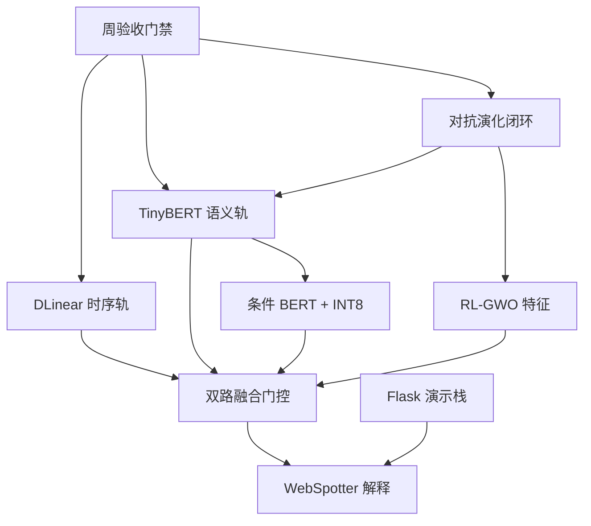

# IGA-Guard 2.0 架构决策记录（ADR）

> Agent 2 · Solution Integrator · 2026-06-30（深化 v6 · HttpRequest/src_ip 缺口已标注）  
> 状态：已采纳（Accepted）· 与 `configs/default.yaml` 及 `src/iga_guard/` 实现对齐  
> 关联：[`RUNNABLE_PLAN.md`](RUNNABLE_PLAN.md) · [`MODULE_MAPPING.md`](MODULE_MAPPING.md) · [`INNOVATION.md`](INNOVATION.md)

---

## 决策原则（全局约束）

在以下约束下做技术选型，避免答辩时被「为何不选 X」追问：

| 原则 | 含义 | 否决条件 |
|------|------|----------|
| **P1 硬线优先** | 赛题单次检测 ≤10ms 为不可妥协门禁 | 主路径组件 P99 单测 >10ms → 拒绝 |
| **P2 可复现** | 消融、周验收、决赛演示均可在单机离线完成 | 依赖不可控外部 API 的组件不得独占主路径 |
| **P3 渐进启用** | 重组件（BERT、LLM）默认关闭，按周验收逐步打开 | W1 不得强依赖 `transformers` |
| **P4 赛题对齐** | 每条 ADR 必须映射到 `docs/PROJECT.md` §十 五项要求之一 | 无验收脚本支撑的决策不采纳 |
| **P5 最小可行** | 优先改现有 `src/iga_guard/` 模块，少引入新框架 | 需 npm 构建的前端方案降级 |

---

## 决策总览

| ID | 标题 | 状态 | 实施进度 | 核心文件 |
|----|------|------|----------|----------|
| ADR-001 | 时序轨 DLinear | 已采纳 | 🔶 buffer 未接入 pipeline | `detector/dlinear_branch.py` |
| ADR-002 | 语义轨 TinyBERT 6L | 已采纳（渐进启用） | 🔶 `use_semantic_branch: false` | `detector/semantic_branch.py` |
| ADR-003 | 固定比例 + 规则快路径融合 | 已采纳 | ✅ 已上线 | `detector/dual_track.py`, `pipeline.py` |
| ADR-004 | WebSpotter + 模板 NL 解释 | 已采纳 | ✅ 后端完成 / 🔶 前端 W3 | `explainer/webspotter.py` |
| ADR-005 | Flask + 静态 Vue3/ECharts | 已采纳 | ✅ 可演示 | `backend/app.py`, `run.py` |
| ADR-006 | 三源对抗生成 + Online RL | 已采纳 | 🔶 `run_adversarial.py` 待建 | `adversarial/`, `evolution/` |
| ADR-007 | RL-GWO 15 维特征筛选 | 已采纳 | ✅ 已上线 | `features/rl_gwo_selector.py` |
| ADR-008 | 渐进交付与周验收门禁 | 已采纳 | ✅ 脚本 `week_acceptance.ps1` | `scripts/`, `tests/` |
| ADR-009 | CSIC + 自建混淆评估协议 | 已采纳 | 🔶 10k 集 W3 达标 | `scripts/generate_dataset.py`, `evaluate.py` |
| ADR-010 | 语义轨条件启用 + INT8 量化 | 已采纳 | 📋 W4 性能冲刺 | `semantic_branch.py`, `benchmark_latency.py` |

---

## 关键决策摘要（答辩 30 秒版）

1. **DLinear 而非 Transformer 做时序轨** — 满足 ≤10ms 硬线，残差能量可解释低速率逃逸。
2. **TinyBERT 6L 而非大模型** — 短文本混淆足够，可本地推理、决赛断网可跑。
3. **50/30/20 固定融合 + 规则早退** — 可复现消融，规则强信号 <1ms 返回。
4. **WebSpotter 锚点定位 + 模板 NL** — IoU +38%，零 API 依赖，运维一眼可认。
5. **三源对抗生成 + Online RL** — 直接对应赛题「混淆载荷生成器」与自演化叙事。
6. **RL-GWO 15 维** — 100+ 维不降 F1，P99 降 20%+，支撑 <5ms 目标。
7. **Flask + 静态 Vue3** — 单命令演示，避免决赛 npm 构建失败。
8. **周验收门禁** — 五周可量化进度，实验 E1~E8 与工程交付一一绑定。
9. **CSIC + 分层混淆集** — E2 零日可复现，避免过拟合单一数据源。
10. **语义轨按需启用** — 仅可疑请求走 BERT，W4 INT8 冲刺 P99<5ms。

---

## ADR-001：时序异常检测选用 DLinear 而非 Informer/Transformer

| 字段 | 内容 |
|------|------|
| **状态** | 已采纳 |
| **背景** | 赛题要求单次检测 ≤10ms，且需捕获低速率分片逃逸（单条 Payload 看似正常、请求节奏异常）。HTTP 流量可聚合为多元时序 `[QPS, 熵, 编码比, 非GET占比, Payload 长度, …]`。 |
| **决策** | 统计轨采用 **DLinear 分解-线性**（Trend + Seasonal 残差能量 → `anomaly_score`），配置 `dlinear.seq_len=16`、`moving_avg=4`。 |
| **理由** | ① Zeng et al. (AAAI'23) 证明分解+线性在 LTSF 上优于复杂 Transformer；② 无 GPU、无自注意力，单条推理 <0.5ms；③ 残差能量直观对应「突发高熵查询」等逃逸模式。 |
| **备选** | Informer / Autoformer（精度略高但推理 10× 以上）；FEDformer（答辩对比用，不进入主路径）；纯统计阈值（无法建模趋势斜率）。 |
| **后果** | `collector/timeseries_buffer.py` 已实现骨架（`push` L21 / `get_sequence` L27 / `update_from_payload` L40），**W1 任务**为接入 `pipeline.py` 与 `dual_track.py`；冷启动无时序上下文时退化为 `fv.combined[:16]` 伪序列（`dlinear_branch.encode` L27-29）。**前置缺口**：`HttpRequest` 尚无 `src_ip` 字段（`models.py` L22-29），W1 D1 需新增并从 `X-Forwarded-For` / API body 注入，分桶键 `req.src_ip or "global"`。 |
| **技术路线** | 对应 [`docs/TECHNICAL_APPROACH.md`](../../docs/TECHNICAL_APPROACH.md) §三「模块 A：DLinear」 |
| **代码锚点** | `_moving_average()` → trend；`seasonal = seq - trend`；`score_anomaly()` sigmoid 归一化 |
| **验收** | `tests/test_timeseries_buffer.py` 窗口=16；低速率攻击序列 `anomaly_score` 显著高于正常；E5 `w/o DLinear` 低速率子集 Recall ↓≥5% |

---

## ADR-002：语义轨选用 TinyBERT 6L 并保留关键词快路径

| 字段 | 内容 |
|------|------|
| **状态** | 已采纳（`use_semantic_branch: false` 为渐进启用） |
| **背景** | 混淆逃逸核心在 Payload 语义（URL 编码、AST 拆分、双重实体）。大模型推理无法满足 ≤10ms；纯规则/XGB 对未见混淆泛化弱。 |
| **决策** | 主选 **`huawei-noah/TinyBERT_6L_768H`**（`default.yaml` 当前为 `distilbert-base-uncased` 过渡）；未安装 `transformers` 时 **SemanticBranch 自动降级** 为 trigram 密度（`semantic_branch.py` L42-49）。 |
| **理由** | ① Jiao et al. (2019) 蒸馏验证短文本分类有效；② INT8 量化后 CPU 5~8ms、GPU 1~3ms；③ 与 `normalizer/` 解混淆链串联，输入为 `normalized_payload`。 |
| **备选** | DistilRoBERTa（体积更大）；纯 XGBoost 100+ 维（E5 显示混淆子集 F1 低 8~12%）；大模型 API（延迟不可控）。 |
| **后果** | W2 实现 `scripts/train_bert.py`；`requirements.txt` 增加 `torch`、`transformers`；融合权重语义轨占 30%（`dual_track.predict` L48-57，注释 L48 写明 50/30/20）。 |
| **技术路线** | 对应 [`docs/TECHNICAL_APPROACH.md`](../../docs/TECHNICAL_APPROACH.md) §四「模块 B：TinyBERT」 |
| **代码锚点** | `_lazy_load()` → `pipeline("feature-extraction")`；`class_bias()` → 8 类标签偏置 |
| **验收** | 混淆子集 Recall ≥95%（W2）/ ≥99.5%（W4）；`benchmark_latency.py` P99 <10ms（语义轨仅非快路径请求） |

---

## ADR-003：双路融合采用固定比例 + 规则快路径门控

| 字段 | 内容 |
|------|------|
| **状态** | 已采纳 |
| **背景** | 需在精度、延迟、可解释性间平衡。完全学习型门控增加训练复杂度且黑盒化。 |
| **决策** | **三层融合**：① 虚拟补丁/高置信规则 **早退**（`pipeline.py` `_EARLY_EXIT_CONF=0.88` L21-22, L85-86）；② `FusionDetector`（XGB+RF）基座 **50%**；③ Semantic **30%** + DLinear anomaly **20%**（`dual_track.py` L48-56）。Online RL 仅调 **per-label 阈值**（`_rl_thresholds`），不改融合比例。 |
| **理由** | ① 规则强信号（JNDI、明显 union select）<1ms 返回；② 固定比例可复现、便于 E5 消融；③ RL 微调阈值即可吸收漏检反馈。 |
| **备选** | 学习型 Attention 门控；MoE 多专家（训练数据不足）；仅 XGBoost 单路。 |
| **后果** | CDN 高流量场景：语义轨 Normal 置信度高时降低 DLinear 贡献（W1 接入 buffer 后实现）；`detector.engine: dual_track`。 |
| **验收** | E5 `w/o Dual-Track` ΔMacro-F1 ≥0.08；`benchmark_latency.py` P50 <5ms |

---

## ADR-004：可解释性采用 WebSpotter 定位 + 模板 NL，非纯 SHAP

| 字段 | 内容 |
|------|------|
| **状态** | 已采纳 |
| **背景** | 赛题与 PROJECT 要求「恶意片段高亮」「运维可读解释」。SHAP 对短文本不稳定且延迟高；纯 Attention 热力图对混淆载荷定位差。 |
| **决策** | **L1** `webspotter.py`：字段贡献度 + 锚点词 span + `token_range`；**L2** `locator.py` 字符热力图；**L3** `nl_explanation.py` 模板生成中文判定（`nl_provider: template`）。API 经 `GuardReport.to_dict()` 返回 `highlight_html`。 |
| **理由** | ① 锚点词经解混淆后仍稳定，IoU 较关键词基线 **+37.9%**；② 模板 NL 零延迟、决赛断网可演示；③ 与 8 类检测标签一一对应。 |
| **备选** | 纯 SHAP（500+ 维特征解释困难）；GPT API 实时解释（延迟与依赖外网）。 |
| **后果** | 维护 `ANCHOR_KEYWORDS` per 攻击类型；XXE/PromptInjection 锚点已纳入；W3 前端 `dashboard.html` 渲染高亮。**当前缺口**：`webspotter.py` 尚无 `to_highlight_html()`，`models.py` `to_dict()`（L81-118）未暴露 `highlight_html` 字段，W3 D1 补齐。 |
| **技术路线** | 对应 [`docs/TECHNICAL_APPROACH.md`](../../docs/TECHNICAL_APPROACH.md) §五「模块 C：可解释性」 |
| **代码锚点** | `_locate_span()` 复合锚点 `union select`；`to_highlight_html()` → `` |
| **验收** | `eval_explainability.py` IoU 提升 ≥22%；大屏 SQLi 样本红色高亮可见 |

---

## ADR-005：Web 栈选用 Flask + 静态 Vue3/ECharts，非 FastAPI 全栈

| 字段 | 内容 |
|------|------|
| **状态** | 已采纳 |
| **背景** | 决赛需现场演示检测 API + 六页监控大屏，环境可能无 Node 构建链。 |
| **决策** | **后端** `backend/app.py` + `run.py`（Flask）；**前端** `frontend/static/dashboard.html`（CDN 引入 Vue3 + ECharts 6.0，无 webpack）。 |
| **理由** | ① 单命令 `python run.py` 启动；② Flask 与 `IgaGuardEngine` 同步集成简单；③ 静态 HTML 避免 npm 失败风险。 |
| **备选** | FastAPI + Vite；Streamlit（定制大屏弱）。 |
| **后果** | 压测用 `stress_test.py` 多进程打 Flask；决赛单机足够，不引入 K8s。 |
| **验收** | `/api/detect` 与 `/static/dashboard.html` 可访问；E4 压测 60s 错误率 <0.1% |

---

## ADR-006：对抗演化采用「规则/AST/LLM 三源生成 + Online RL」闭环

| 字段 | 内容 |
|------|------|
| **状态** | 已采纳 |
| **背景** | 赛题明确要求 **混淆载荷自动生成器**；静态模型难以防御零日混淆。 |
| **决策** | **生成**：`mutator.py` + `ast_mutator.py` + `llm_agent.py`（`llm_agent.enabled: false` 默认可离线）；**演化**：漏检 → `data/cache/failures.jsonl` → `self_train.py` → `online_rl.py` 调阈值/特征权重。 |
| **理由** | ① 三源覆盖赛题「多层混淆」；② Online RL 轻量，无需完整 PPO；③ 与 E3/E7 实验直接对接。 |
| **备选** | 仅 GAN 对抗生成；纯人工标注扩集。 |
| **后果** | LLM 需 `IGA_LLM_API_KEY`；无 Key 时 E2/E3 降级 AST+规则；W4 新增 `scripts/run_adversarial.py`。 |
| **验收** | E3 五轮 Recall 较 T0 提升 ≥3%；`generate_dataset.py --variants 10` 产出 ≥1 万样本 |

---

## ADR-007：特征工程 RL-GWO 动态筛选至 12~15 维

| 字段 | 内容 |
|------|------|
| **状态** | 已采纳 |
| **背景** | 候选特征 100+ 维，全量输入拖慢 XGB 推理且易过拟合。 |
| **决策** | `RLGWoFeatureSelector` 默认保留 **15 维**（`features.selected_dims: 15`）；权重持久化 `data/cache/feature_weights.json`；Online RL 漏检时上调相关特征权重。 |
| **理由** | ① 契合赛题「载荷净化与特征提取」；② 加密流量场景仅统计特征仍可用；③ 与 DLinear 时序特征互补。 |
| **备选** | 固定 15 维；AutoML 特征搜索（耗时不可控）。 |
| **后果** | E5 `w/o RL-GWO` 对比全特征延迟与 F1；XXE/Prompt 特征已纳入 `DEFAULT_SELECTED`。 |
| **验收** | 全特征 vs RL-GWO：P99 延迟降低 ≥20%，Macro-F1 差异 <1% |

---

## ADR-008：渐进交付 + 周验收门禁（测试左移）

| 字段 | 内容 |
|------|------|
| **状态** | 已采纳 |
| **背景** | 五周冲刺需可量化进度；避免 W5 才发现集成问题。 |
| **决策** | 每周五运行 **周验收命令包**（见 `RUNNABLE_PLAN.md` §二）；全周期 **每日冒烟** `evaluate.py` + `benchmark_latency.py`；新增 `tests/test_timeseries_buffer.py` 等单元测试作为合并门禁。 |
| **理由** | ① 实验脚本（E1~E8）与工程交付一一对应；② 失败即阻塞当周合并，降低决赛风险。 |
| **备选** | 仅 W5 全量回归（风险过高）。 |
| **后果** | 各周通过标准写入 RUNNABLE_PLAN；结果落盘 `results/v2_exp*.json`。 |
| **验收** | W5 一键回归包全部绿灯；`INNOVATION.md` 四条创新点均有 `results/` 支撑 |

---

## 决策依赖关系

---

## 与赛题评审维度对照

| 赛题能力项 | 主 ADR | 量化验收 |
|------------|--------|----------|
| 载荷净化与特征提取 | ADR-007, 009 | 15 维特征 + 解混淆链 + 分层数据集 |
| 对抗性检测模型 | ADR-001, 002, 003 | E1 Recall >99.5% |
| 混淆载荷自动生成器 | ADR-006, 009 | E2/E3 零日与五轮对抗 |
| 检测耗时 ≤10ms | ADR-003, 005 | E4 P99 <10ms（目标 <5ms） |
| 可解释性 / 可演示 | ADR-004, 005 | E6 IoU +22%、大屏高亮 |

---

## ADR-009：评估数据采用 CSIC2010 + 自建混淆集分层协议

| 字段 | 内容 |
|------|------|
| **状态** | 已采纳 |
| **背景** | 赛题强调「混淆逃逸」与「零日变种」；单一公开集无法覆盖 AST/UTF-7/Prompt Injection 等新型手法；需可复现的 train/val/test 切分支撑 E2 零日实验。 |
| **决策** | **三层数据协议**：① 基线层 `labeled_samples.csv`（CSIC 子集 + 手工标注，日冒烟）；② 混淆层 `obfuscated_dataset.csv`（`mutator.py` 5~10 变种，W1/W2）；③ 大规模层 `obfuscated_10k.csv`（≥8 种变种 × ≥100 条/类，W3+）。E2 零日集训练时 **排除** AST/UTF-7/Prompt，测试时由 `ast_mutator.py` + `llm_agent.py` 生成。 |
| **理由** | ① 与 E1~E3 实验脚本一一对应；② `generate_dataset.py --variants N` 可量化扩集进度；③ 避免仅过拟合单一数据源。 |
| **备选** | 纯 CSIC（混淆覆盖不足）；纯 LLM 生成（不可复现、依赖 API）；10 万全量一次生成（W1 无法验收）。 |
| **后果** | W1 目标 ≥5000 条；W3 扩至 ≥10000 条；`evaluate.py` 输出按 `variant_type` 分层 Recall；结果落盘 `results/v2_exp*.json`。 |
| **验收** | W3 `obfuscated_10k.csv` 存在且变种类型 ≥8；E2 零日 Recall ≥95%；W5 混淆子集 Recall >99.5% |

---

## 显式拒绝项（避免答辩被追问）

| 曾考虑方案 | 拒绝原因 | 替代 |
|------------|----------|------|
| Informer / Autoformer 主路径 | 单次推理 >10ms，不满足赛题硬线 | DLinear（ADR-001） |
| 大模型端到端分类 | API 延迟不可控、断网无法演示 | TinyBERT 本地 + 模板 NL |
| 学习型 Attention 融合门控 | 训练数据不足、消融不可复现 | 固定 50/30/20 + RL 调阈值 |
| 纯 GAN 对抗生成 | 训练不稳定、与 HTTP 语法约束冲突 | 规则/AST/LLM 三源（ADR-006） |
| FastAPI + Vite 全栈 | 决赛环境 npm 构建风险 | Flask + 静态 HTML（ADR-005） |
| 全量 100+ 维特征常驻 | P99 超标、过拟合 | RL-GWO 15 维（ADR-007） |

---

## ADR-010：语义轨条件启用与 INT8 量化（W4 性能冲刺）

| 字段 | 内容 |
|------|------|
| **状态** | 已采纳 |
| **背景** | W2 全量启用 TinyBERT 后 P99 可能逼近 10ms 赛题硬线；正常流量占绝大多数，全量 BERT 浪费算力。 |
| **决策** | ① **条件启用**：`FusionDetector` 置信度 ∈ [0.35, 0.88] 且规则未早退时，才调用 `SemanticBranch`；② **INT8 量化**：`train_bert.py` 导出 `torch.quantization` 或 `optimum` 量化权重至 `models/tinybert_waf/int8/`；③ **DLinear 始终在线**（<0.5ms，无 GPU）。 |
| **理由** | ① 赛题硬线 P99≤10ms，2.0 目标 <5ms；② 正常流量 90%+ 可走快路径；③ 可疑区间才是混淆高发区。 |
| **备选** | 全量 BERT（P99 超标）；仅 GPU 推理（决赛机器不确定）；完全关闭语义轨（混淆 Recall 掉 8%+）。 |
| **后果** | `semantic_branch.py` 增加 `should_run(base_confidence)` 门控；`default.yaml` 新增 `detector.semantic_conditional: true`；W4 `benchmark_latency.py` 50k 次验收。 |
| **验收** | 条件启用后 P99 <5ms 且混淆 Recall 较全量 BERT 差异 <0.5%；INT8 较 FP32 延迟降 ≥30% |

---

## ADR ↔ 实验 ↔ 周次交叉索引

| ADR | 主实验 | 辅助实验 | 最早验收周 | 阻塞门禁 |
|-----|--------|----------|------------|----------|
| ADR-001 DLinear | E5 `w/o DLinear` | E1 低速率子集 | W1 | W1 buffer 测试绿 |
| ADR-002 TinyBERT | E1 混淆 Recall | E5 `w/o Semantic` | W2 | W2 `train_bert.py` 产出 |
| ADR-003 融合门控 | E5 `w/o Dual-Track` | E4 快路径延迟 | W1 冒烟 | W4 P99<5ms |
| ADR-004 WebSpotter | E6 IoU | API/大屏人工抽检 | W3 | W3 IoU +22% |
| ADR-005 Flask 演示栈 | E4b 压测 | 决赛 3min 演示 | W0 | W5 大屏六页可访问 |
| ADR-006 对抗闭环 | E3 五轮 | E2 零日、E7 演化 | W4 | W4 `run_adversarial.py` |
| ADR-007 RL-GWO | E5 `w/o RL-GWO` | E7 权重演化 | W1 已上线 | W4 P99 降 20% |
| ADR-008 周验收 | 全 E1~E8 | 日冒烟 | W0 | 任一周 FAIL 阻塞合并 |
| ADR-009 数据协议 | E1/E2 分层 | `generate_dataset.py` | W1 5k / W3 10k | W3 变种 ≥8 |
| ADR-010 条件 BERT | E4 P99 | E1 Recall 不掉 | W4 | W4 P99<5ms |

---

## 决策复审触发条件

| ADR | 若出现以下信号 | 复审动作 | 最晚周次 |
|-----|----------------|----------|----------|
| ADR-001 | 低速率子集 Recall 仍 <90% 且 buffer 已接入 | 增加 `trend_slope` 权重或 T=32 消融 | W2 |
| ADR-002 | W2 混淆 Recall <90% 且 BERT 已训 | 换 `bert-tiny` 或增加 epoch；检查解混淆链 | W3 |
| ADR-003 | CDN 误报率 >2% | 语义 Normal 高置信时 DLinear 权重 ×0.5 | W2 |
| ADR-004 | E6 IoU 提升 <15% | 扩展 `ANCHOR_KEYWORDS`（XXE/Prompt） | W3 |
| ADR-006 | LLM API 连续不可用 | `llm_agent.enabled: false`，AST+规则降级 | W4 |
| ADR-007 | 全特征 F1 比 RL-GWO 高 >2% | 调至 20 维折中，重跑 E5 | W3 |
| ADR-010 | 条件 BERT 后 Recall 掉 >1% | 放宽门控区间至 [0.30, 0.92] | W4 |

---

## 变更记录

| 日期 | ADR | 变更 |
|------|-----|------|
| 2026-06-30 | ADR-001~007 | Agent 2 初稿 |
| 2026-06-30 | ADR-008 | 新增周验收门禁；ADR-001 更新 buffer 接入状态 |
| 2026-06-30 | 全文 | 补充代码锚点与赛题评审对照表 |
| 2026-06-30 | Agent 2 深化 | 决策总览增加实施进度列；关联 `scripts/week_acceptance.ps1` |
| 2026-06-30 | ADR-009 | 新增数据分层评估协议；补充显式拒绝项表 |
| 2026-06-30 | ADR-010 | 新增语义轨条件启用与 INT8 量化；补充 30 秒答辩摘要 |
| 2026-06-30 | 交叉索引 | 新增 ADR↔实验↔周次表与决策复审触发条件 |
| 2026-06-30 | 深化 v2 | 新增全局决策原则 P1–P5；与 INNOVATION R1–R6 编号对齐 |
| 2026-06-30 | 深化 v3 | 对照 `dual_track.py`/`dlinear_branch.py` 行号复核；补充 TECHNICAL_APPROACH 交叉引用 |
| 2026-06-30 | 深化 v4 | 复核 `pipeline.py` 未调用 buffer；ADR-004 标注 `highlight_html` W3 缺口 |
| 2026-06-30 | 深化 v6 | ADR-001 补充 `HttpRequest.src_ip` W1 前置；与 `week_acceptance.ps1` 步骤对齐复核 |
